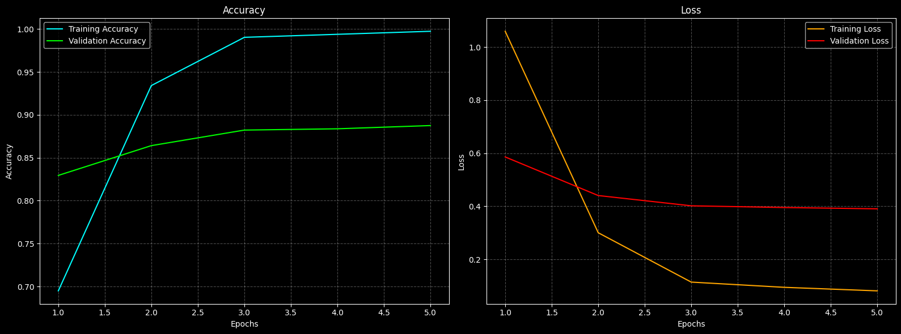

# Iranian Car Fine-Grained Image Classification

## Project Overview

This project aims to accurately identify and classify various Iranian car models using advanced Fine-Grained Image Classification techniques. Leveraging a pretrained **ResNet-50 backbone**, dual **CBAM attention modules**, and **bilinear pooling**, the model distinguishes subtle visual differences between closely related car classes.

---

## Key Features

* **Transfer Learning** with ResNet-50 pretrained on ImageNet for robust feature extraction
* **Dual CBAM Modules** (Channel & Spatial Attention) to focus on critical image regions
* **Bilinear Pooling** for rich feature interaction
* Comprehensive **Data Augmentation**: Random rotations, flips, brightness shifts
* Custom **Learning Rate Scheduler** and optional **Early Stopping**
* Detailed evaluation: Confusion matrix, classification report, and Grad-CAM visualizations

---

## Repository Structure

```plaintext
├── data/
│   ├── train/
│   └── val/
├── notebooks/
│   └── Iranian_car_FGIC.ipynb
├── models/
│   └── best_model.h5
├── requirements.txt
└── README.md
```

---

## Installation

1. **Clone the repository**:

   ```bash
   git clone https://github.com/ema-item/Iranian-car-classification.git
   cd Iranian-car-classification
   ```
2. **Create and activate a virtual environment** (optional but recommended):

   ```bash
   python3 -m venv venv
   source venv/bin/activate  # Linux/Mac
   venv\Scripts\activate    # Windows
   ```
3. **Install dependencies**:

   ```bash
   pip install -r requirements.txt
   ```

---

## Usage

1. **Prepare your data**: Organize your images under `data/train` and `data/val` folders, each containing subfolders named after the 13 car model classes.
2. **Configure parameters**: Open `notebooks/Iranian_car_FGIC.ipynb` and adjust:

   * `DATA_DIR`: Path to your dataset
   * `BATCH_SIZE`, `EPOCHS`, `LEARNING_RATE`
   * Data augmentation options
3. **Run the notebook**:

   ```bash
   jupyter notebook notebooks/Iranian_car_FGIC.ipynb
   ```
4. **View results**: Training/validation curves, confusion matrix, classification report, and Grad-CAM heatmaps will be generated inline.

---

## Dataset & Preprocessing

* **Image formats**: JPEG or PNG
* **Number of classes**: 13 distinct Iranian car models
* **Train/Validation split**: Stratified splitting to preserve class balance
* **Preprocessing pipeline**:

  * Resize to network input dimensions
  * Pixel normalization via `tf.keras.applications.resnet.preprocess_input`
  * Real-time data augmentation: rotations, flips, brightness adjustments

---

## Model Architecture

1. **Backbone**: ResNet-50 pretrained on ImageNet
2. **CBAM Attention**:

   * **Channel Attention**: Learns to emphasize informative feature maps
   * **Spatial Attention**: Focuses on important spatial regions
3. **Bilinear Pooling**: Combines channel-wise features for richer representations
4. **Classification Head**: Fully connected layers with softmax activation for 13-way classification

---

## Training Configuration

* **Optimizer**: Adam
* **Initial Learning Rate**: 1e-3
* **Scheduler**: Reduce LR on plateau down to 1e-4
* **Batch Size**: 32
* **Epochs**: Typically 20–30 (configurable)
* **Callbacks**: LearningRateScheduler, ModelCheckpoint, EarlyStopping (optional)

---

## Results & Analysis

* **Validation Accuracy**: \~89% (baseline)
* **Detailed Metrics**: Precision, recall, and F1-score per class in the classification report
* **Visual Insights**:

  * Confusion matrix highlights most misclassified pairs
  * **Grad-CAM** heatmaps reveal model focus areas on sample images

---

## Future Enhancements

* **Full Fine-Tuning**: Unfreeze deeper layers of ResNet-50 for end-to-end training
* **Advanced Augmentation**: Integrate MixUp, CutMix, and Random Erasing
* **Cross-Validation**: Implement K-Fold to ensure robustness and reduce variance
* **Attention Variants**: Experiment with alternative attention mechanisms like SE blocks
* **Hyperparameter Tuning**: Leverage tools like Optuna or Hyperopt for automated search

---

## Testing result

- accuracy                         0.8919      1323
- macro avg     0.8922    0.8941    0.8922      1323
- weighted avg     0.8935    0.8919    0.8917      1323

- Precision(macro): 0.8922
- Recall(macro):    0.8941
- F1 Score(macro):  0.8922
- F1 Score(micro):  0.8919
- Test Loss : 0.30

---

## Visualizations

### Accuracy and Loss



### Confusion Matrix

.png)

### Sample Predictions

.png)

---

## License

This project is released under the **MIT License**. Feel free to use, modify, and distribute.

---
## How to Run

1. Clone or download this repository.
2. Install dependencies:
   ```bash
   pip install -r requirements.txt
